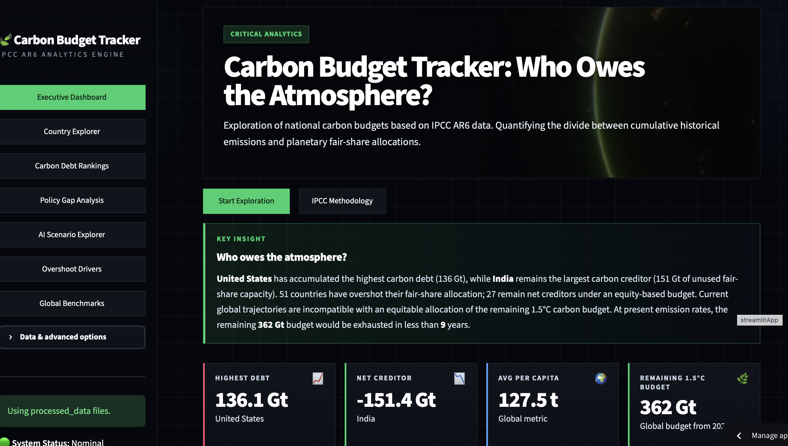

# Carbon Budget Tracker

## Who Owes the Atmosphere?

### Quantifying National Responsibility and Policy Gaps under the Paris Agreement

---

## The Question

The Paris Agreement defines a finite remaining carbon budget.

Yet one fundamental question remains largely unanswered:

**How much of that remaining budget should each country be entitled to use?**

The Carbon Budget Tracker addresses this question by translating global carbon budgets into country-level fair-share allocations and measuring when countries exceed those limits.

---

## Key Findings

* 51 countries have already exhausted their fair-share carbon budget.
* The United States has accumulated the largest carbon debt (136 Gt CO₂).
* India remains the largest net carbon creditor (151 Gt CO₂).
* Current climate pledges often reduce but do not eliminate overshoot.
* At current emissions rates, the remaining 1.5°C carbon budget may be exhausted within a decade.

---

## Live Dashboard

🌍 Explore the platform:

https://carbon-budget-tracker-ko3xfkqxqq8suy57iccvqr.streamlit.app

---

## Research Paper

📄 Full methodology and analysis:

**From Fair Shares to Carbon Debt: Quantifying National Responsibility and Policy Gaps under the Paris Agreement**

Available in this repository.

---

## Why This Matters

Most climate trackers focus on annual emissions, carbon intensity, or net-zero pledges.

The Carbon Budget Tracker focuses on something different:

* Fair-share carbon budgets
* Historical responsibility
* Carbon debt
* Overshoot timing
* Policy gaps
* Future drawdown obligations

The framework provides an equity-based perspective on climate responsibility that is often missing from conventional emissions reporting.

---

## Dashboard Overview

### Executive Dashboard

Global overview of carbon debt, overshoot status, and remaining carbon budgets.

### Country Explorer

Interactive country profiles including fair-share budgets, debt, overshoot timing, and policy gaps.

### Carbon Debt Rankings

Global rankings of debtors and creditors.

### Policy Gap Analysis

Comparison between overshoot timing and national climate commitments.

### AI Scenario Explorer

Future overshoot trajectories under alternative demand scenarios.

### Overshoot Drivers

Structural factors associated with national overshoot patterns.

### Global Benchmarks

Comparison against IPCC AR6 carbon budget thresholds.

---

## Methodology

The framework combines:

1. Fair-share carbon budget allocation
2. Historical emissions accounting
3. Carbon debt calculation
4. Overshoot-year estimation
5. Policy-gap analysis
6. Future drawdown modeling

### Core Equation

Carbon Debt = Historical Emissions − Fair-Share Budget

---

## Data Sources

* IPCC AR6 Carbon Budgets
* Global Carbon Budget
* Our World in Data
* UNFCCC NDC Registry
* World Bank Development Indicators

---

## Technical Stack

Python • Pandas • NumPy • Plotly • Streamlit • Jupyter Notebooks

---

## Author

**Nisha Verma, PhD**

Sustainability Analytics | Climate Policy | Data Science

Berlin, Germany

---

## License

MIT License

